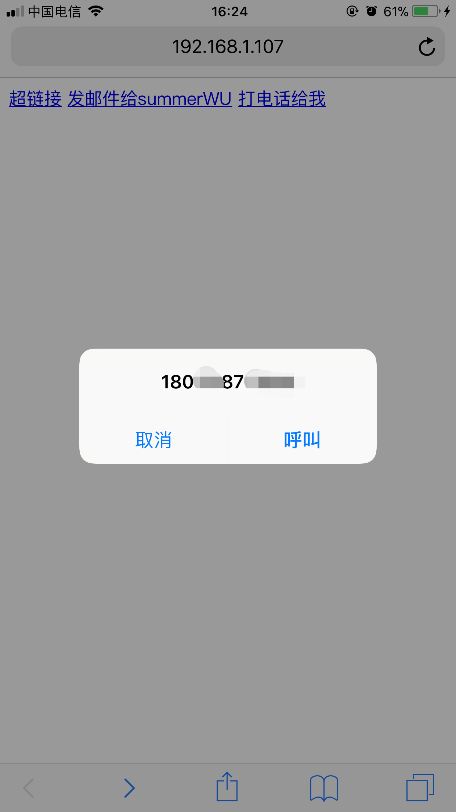

## a标签的用法
* href属性
  1. 超链接，链接到一个网址或者一个文件
  2. mailto 点击可直接发送邮件
  3. tel+手机号码，在手机端使用时，会是这个效果，在自制简历时可用
   
```html
    <a href="https//:google.com">超链接</a>
    <a href="2.jpg">超链接</a>
    <a href="mailto:583314838@qq.com">发邮件给summerWU</a>
    <a href="tel"></a> 
    <a href="tel:18012345678">打电话给我</a>
 ```
  4. 伪协议 javascript:代码;
   ```html
    <a href="javascript:alerta(1);">弹出对话框0</a>
    <a href="javascript:;">点击a标签不会有任何变动，不会刷新页面</a>
   ```
   5. id,点击会跳转到对应id为xxx的标签处
   ```html
   <a href="id=xxx">点击跳转</a>
   ```
 <br>
 * target属性
  ```html
   <a href="//:baidu.com" target="_blank">在新页面打开</a>
    <a href="//:baidu.com" target="_self">在自身面打开，为默认值</a>
    <a href="//:baidu.com" target="_top">在顶部窗口打开</a>
    <a href="//:baidu.com" target="_parent">在上一级的窗口打开</a>
```

1. 插入一个iframe（内嵌浏览器），命名为xxx,
2. 当点击第一个链接baidu时，会在名为xxx的内嵌浏览器里打开百度
3. 当点击第二个链接sohu时，会在名为xxx的内嵌浏览器里打搜狐
4. 再修改一下iframe的样式，就可以做一个页面切换不同浏览器的效果

 ```html
    <a href="//baidu.com" target="xxx">baidu</a>
    <a href="//sohu.com" target="xxx">sohu</a>

    <iframe name="xxx"
            style="border: none; width: 100%; height: 800px"  
            src="" 
            frameborder="0" 
            >
    </iframe>
```
<br>

## img 标签的用法
* 属性：
  alt='图片注释'
  height/width 设置图片高宽，如果单设置宽，高会自适应；单设置高，宽会自适应；如果同时设置宽高，图片会变形

* 事件 onload/onerror
  可以js测试图片加载是否成功，如果加载失败可以改变图片路径，使用备用图片
```html
 

    <script>
        xxx.onload = function(){
            console.log('加载成功');
        } 
        xxx.onerror = function(){
            console.log('加载失败');
            xxx.src ='/404.png'
        } 
    </script>
```
* 响应式（手机可以看，自适应） max-width: 100%;
  ```html
  <style>
        *{
            padding: 0;
            margin: 0;
            box-sizing: border-box;
        }
        img{
            max-width: 100%;
        }
    </style>
    ```
<br>

## table 标签的用法
* table相关标签
tr table row 表格的一行
th table head 表头（默认加粗）
td table data 表格数据
```html
 <table>
        <thead>
            <tr>
                <th></th>
                <th>
                    傅菁
                </th>
                <th>
                    五选一
                </th>
                <th>
                    杨超越
                </th>
            </tr>
        </thead>
        <tbody>
            <tr>
                <th>初始排名</th>
                <td>9</td>
                <td>2</td>
                <td>78</td>
            </tr>
            <tr>
                <th>出道排名</th>
                <td>10</td>
                <td>2</td>
                <td>3</td>
            </tr>
        </tbody>
        <tfoot>
            <tr>
                <th>毕业排名</th>
                <td>6</td>
                <td>2</td>
                <td>1</td>
            </tr>
        </tfoot>
    </table>
```  
* table相关属性
 table-layout: auto/fixed
 border-collapse: collapse; 合并边框
 border-spacing：0； 边框之间的空隙为0

```html
<style>
        table{
            table-layout: auto;
            border-collapse: collapse;
            border-spacing: 0;
        }

        th,
        tr,
        td{
            border: 1px solid red;
        }
    </style>
```

## form表单的用法
* 作用：发get或post请求，然后刷新页面
* 属性action/method/autocomplete
```html
<!-- action里面写什么，就会请求到对应的页面 -->
<!-- method里面的get和post是用什么方法去请求页面 -->
<!-- autocomplete表示自动填充，on/off,on的时候会自动提示用户之前输入过的填充内容 -->
    <form action="xxx" method="POST" autocomplete="on">
        <input type="text" name="username" id="" required>
        <input type="submit" name="" id="">
    </form>
```
* 属性target
```html
<!-- target到a，a为一个内嵌浏览器，那么就在名字为a的内嵌浏览器里打开action里面的网址 target='_blank',表示在新页面打开请求的地址-->
    <form action="//baidu.com" method="GET" autocomplete="on" target="a">
    <input type="text" name="username">
    <input type="submit">
    <iframe name="a" src="a-target-iframe2.html" frameborder="0"></iframe>
    </form>
```
<br>

## input标签的用法
* <input type="submit">和 <button type="submit"></button>的区别，在于button里面还可以加标签
```html
<input type="submit" value="雄起">
        <button type="submit">
            <strong>雄起</strong>
            
        </button>
```
* 常用的属性
```html
<!-- required表示必须填写 -->
        <input type="password" name="psd" required>
        <hr>
        <!-- 单选，一定要同一个name，告诉电脑是一组的 -->
        <input type="radio" name="gender">男
        <input type="radio" name="gender">女
        <hr>
        <!-- 多选，也是要告诉电脑一个name，是一组的，checked表示默认选项 -->
        <input type="checkbox" name="hobby" checked>sing
        <input type="checkbox" name="hobby">dance
        <input type="checkbox" name="hobby">rap
        <hr>
        <!-- 选择上传文件，multiple表示可选多个文件，如果不加则只能上传一个文件
         -->
        <input type="file" multiple>
        <hr>
        <!-- 给机器看的 -->
        看不见的<input type="hidden">
        <hr>
        <!-- 输入框，右下角可拖动大小，style的resize:none可以禁止拖动给 -->
        <textarea name="" id="" cols="30" rows="10"></textarea>
        <textarea name="" id="" style="resize: none;width: 50%;height: 200px; "></textarea>
        <hr>
        select表示选择，option表示选项
        <select  name="" id="">
            <option value="">--请选择--</option>
            <option value="1">星期一</option>
            <option value="2">星期二</option>
        </select>
```
* input的事件
1. onchange
2. onfocus
3. onblur

* 注意事项
  1. 一般不监听input的click事件
  2. form里面的input要有name，多起来的时候好区分
  3. form里一定要放一个type=submit才能处罚onsubmit事件